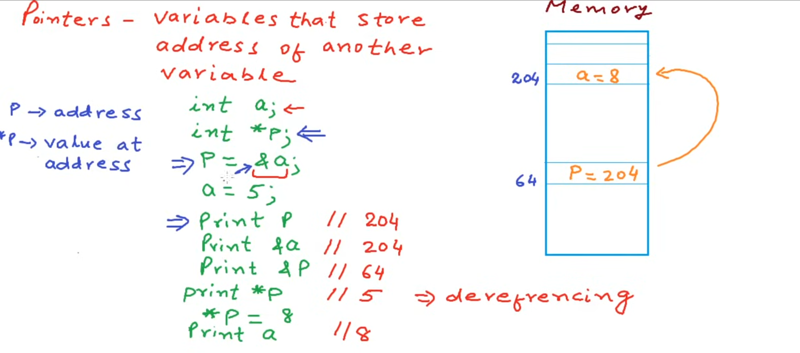

# Pointers in C

## Part 1: A pointer is also a variable

Sometimes when we learn pointers, we focus so much on the address they store that we forget something basic: **a pointer is also a variable. It has its own address.**

I want to start here because it helps separate three expressions that can look confusing at first: `p`, `&p` and `*p`. They do different jobs.

I made this note while studying [Working with pointers on YouTube](https://www.youtube.com/watch?v=X1DcpcgSUXw). The screenshot below comes from that lesson. I am using it as a reference for the explanation and do not claim the original illustration as my own work.

<p align="center">
  
  <br>
  <sub>Source: <a href="https://www.youtube.com/watch?v=X1DcpcgSUXw">Working with pointers</a>. The numbers 64 and 204 illustrate memory addresses.</sub>
</p>

### Two variables and two addresses

Let me write the example in C with the variables initialized before use:

```c
int a = 5;
int *p = &a;
```

There are two variables here. `a` holds an integer value. `p` holds a pointer to an integer. The initializer `&a` gives `p` the address of `a`.

For the picture, imagine `a` is located at address 204 and `p` is located at address 64. The value stored in `a` is initially 5. The pointer value stored in `p` identifies address 204.

**The address stored inside `p` is not the address of `p` itself.** In this example, the stored address is 204 while the pointer variable's own address is 64.

These are teaching numbers. The actual addresses depend on your program and its execution environment. Do not assume a particular address, spacing between variables or pointer size from this drawing.

### What does `p` mean?

Using `p` as a value gives the pointer value stored in that variable. After `p = &a`, it points to `a`.

In the picture, that is address 204. Reading `p` does not read the integer 5. It gives the pointer that tells us where that integer is located.

### What does `&p` mean?

The `&` operator obtains the address of an object. `&a` gives the address of `a`. In the same way, **`&p` gives the address of the pointer variable itself**.

In the picture, `&p` corresponds to address 64. Because `p` has type `int *`, the expression `&p` has type `int **`, meaning pointer to pointer to int. We will build on that idea later. For now, remember that it identifies where `p` itself lives.

### What does `*p` mean?

Here the star dereferences the pointer. It accesses the integer object that `p` points to. Since `p` points to `a`, reading `*p` gives the value currently stored in `a`.

```c
int a = 5;
int *p = &a;

int value = *p;  // value receives 5.
*p = 8;         // a now holds 8.
```

The assignment `*p = 8` changes `a`. It does not change the pointer value stored in `p`. The pointer still points to `a` and its own address is unchanged.

This also explains the screenshot. Its written steps first show a value of 5, then assign 8 through `*p`. The memory drawing shows `a = 8` after that assignment. Those are different moments in the example.

### The star has different roles in these two places

Compare the declaration with the later expression:

```c
int *p = &a;  // Declaration: p is a pointer to int.
*p = 8;      // Expression: access the pointed integer and assign 8.
```

In the declaration, `*` is part of the declarator and tells C that `p` is a pointer. It is not dereferencing anything there. The declared variable is named `p`, not `*p`.

In the expression, unary `*` is the indirection operator, usually called dereferencing. It accesses the object through the pointer. These are the two roles relevant to this example. In other expressions, a star between two operands can also mean multiplication.

### Compare them side by side

After `int a = 5; int *p = &a;`:

| Expression | What it identifies or supplies | C type | Illustration |
| --- | --- | --- | --- |
| `a` | The integer object; reading it gives its value | `int` | 5 |
| `&a` | Address of a | `int *` | Address 204 |
| `p` | The pointer variable; reading it gives its stored pointer | `int *` | Address 204 |
| `&p` | Address of the pointer variable | `int **` | Address 64 |
| `*p` | The integer object reached through p; reading it gives its value | `int` | 5 |

After `*p = 8`, reading `a` or `*p` gives 8. The addresses shown in the table do not change because of that assignment.

### Try it on your computer

This complete example prints the actual addresses instead of assuming the numbers in the picture:

```c
#include <stdio.h>

int main(void)
{
    int a = 5;
    int *p = &a;

    printf("p  = %p\n", (void *)p);
    printf("&a = %p\n", (void *)&a);
    printf("&p = %p\n", (void *)&p);
    printf("Before: a = %d, *p = %d\n", a, *p);

    *p = 8;

    printf("After:  a = %d, *p = %d\n", a, *p);
    return 0;
}
```

`%p` prints a pointer value and requires a `void *` argument, which is why the casts appear in those calls. `%d` prints an `int` value.

The lines for `p` and `&a` should show the same pointer value. `&p` identifies the separate pointer variable. The final two lines show the integer changing from 5 to 8 through `*p`.

If a C compiler is installed, save the example as `pointers-example.c` and run:

```bash
cc -std=c11 -Wall -Wextra -pedantic-errors pointers-example.c -o pointers-example
./pointers-example
```

Before dereferencing a pointer, make sure it points to a suitable live object. The examples above initialize `p` with `&a` before using `*p`. Declaring `int *p;` alone does not give a local pointer a usable target and a null pointer must not be dereferenced.

The distinction I want to remember is this: **`p` gives the stored pointer, `&p` gives the pointer variable's own address and `*p` accesses the object it points to.**
