# Pointers in C

## Part 1: A pointer is also a variable

Sometimes when we learn pointers, we focus so much on the address they store that we forget something basic: **a pointer is also a variable. It has its own address.**

I want to start here because it helps separate three expressions that can look confusing at first: `p`, `&p` and `*p`. They do different jobs.

I made this note while studying [Working with pointers on YouTube](https://www.youtube.com/watch?v=X1DcpcgSUXw). The screenshot below comes from that lesson. I am using it as a reference for the explanation and do not claim the original illustration as my own work.

<p align="center">
  
  <br>
  <sub>Source: <a href="https://www.youtube.com/watch?v=X1DcpcgSUXw">Working with pointers</a>. The numbers 64 and 204 illustrate memory addresses.</sub>
</p>

### Two variables and two addresses

Let me write the example in C with the variables initialized before use:

```c
int a = 5;
int *p = &a;
```

There are two variables here. `a` holds an integer value. `p` holds a pointer to an integer. The initializer `&a` gives `p` the address of `a`.

For the picture, imagine `a` is located at address 204 and `p` is located at address 64. The value stored in `a` is initially 5. The pointer value stored in `p` identifies address 204.

**The address stored inside `p` is not the address of `p` itself.** In this example, the stored address is 204 while the pointer variable's own address is 64.

These are teaching numbers. The actual addresses depend on your program and its execution environment. Do not assume a particular address, spacing between variables or pointer size from this drawing.

### What does `p` mean?

Using `p` as a value gives the pointer value stored in that variable. After `p = &a`, it points to `a`.

In the picture, that is address 204. Reading `p` does not read the integer 5. It gives the pointer that tells us where that integer is located.

### What does `&p` mean?

The `&` operator obtains the address of an object. `&a` gives the address of `a`. In the same way, **`&p` gives the address of the pointer variable itself**.

In the picture, `&p` corresponds to address 64. Because `p` has type `int *`, the expression `&p` has type `int **`, meaning pointer to pointer to int. We will build on that idea later. For now, remember that it identifies where `p` itself lives.

### What does `*p` mean?

Here the star dereferences the pointer. It accesses the integer object that `p` points to. Since `p` points to `a`, reading `*p` gives the value currently stored in `a`.

```c
int a = 5;
int *p = &a;

int value = *p;  // value receives 5.
*p = 8;         // a now holds 8.
```

The assignment `*p = 8` changes `a`. It does not change the pointer value stored in `p`. The pointer still points to `a` and its own address is unchanged.

This also explains the screenshot. Its written steps first show a value of 5, then assign 8 through `*p`. The memory drawing shows `a = 8` after that assignment. Those are different moments in the example.

### The star has different roles in these two places

Compare the declaration with the later expression:

```c
int *p = &a;  // Declaration: p is a pointer to int.
*p = 8;      // Expression: access the pointed integer and assign 8.
```

In the declaration, `*` is part of the declarator and tells C that `p` is a pointer. It is not dereferencing anything there. The declared variable is named `p`, not `*p`.

In the expression, unary `*` is the indirection operator, usually called dereferencing. It accesses the object through the pointer. These are the two roles relevant to this example. In other expressions, a star between two operands can also mean multiplication.

### Compare them side by side

After `int a = 5; int *p = &a;`:

| Expression | What it identifies or supplies | C type | Illustration |
| --- | --- | --- | --- |
| `a` | The integer object; reading it gives its value | `int` | 5 |
| `&a` | Address of a | `int *` | Address 204 |
| `p` | The pointer variable; reading it gives its stored pointer | `int *` | Address 204 |
| `&p` | Address of the pointer variable | `int **` | Address 64 |
| `*p` | The integer object reached through p; reading it gives its value | `int` | 5 |

After `*p = 8`, reading `a` or `*p` gives 8. The addresses shown in the table do not change because of that assignment.

### Try it on your computer

This complete example prints the actual addresses instead of assuming the numbers in the picture:

```c
#include <stdio.h>

int main(void)
{
    int a = 5;
    int *p = &a;

    printf("p  = %p\n", (void *)p);
    printf("&a = %p\n", (void *)&a);
    printf("&p = %p\n", (void *)&p);
    printf("Before: a = %d, *p = %d\n", a, *p);

    *p = 8;

    printf("After:  a = %d, *p = %d\n", a, *p);
    return 0;
}
```

`%p` prints a pointer value and requires a `void *` argument, which is why the casts appear in those calls. `%d` prints an `int` value.

The lines for `p` and `&a` should show the same pointer value. `&p` identifies the separate pointer variable. The final two lines show the integer changing from 5 to 8 through `*p`.

Before dereferencing a pointer, make sure it points to a suitable live object. The examples above initialize `p` with `&a` before using `*p`. Declaring `int *p;` alone does not give a local pointer a usable target and a null pointer must not be dereferenced.

The distinction I want to remember is this: **`p` gives the stored pointer, `&p` gives the pointer variable's own address and `*p` accesses the object it points to.**

## Part 2: What happens when I add 1 to a pointer?

Now I want to understand what `p + 1` actually means. It looks like ordinary addition but there is one detail to remember: **a pointer takes steps based on the type it points to.**

<p align="center">
  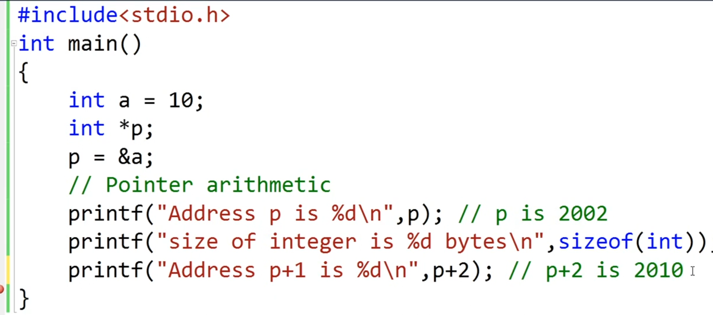
  <br>
  <sub>Lesson screenshot supplied for these notes. Learning reference: <a href="https://www.youtube.com/watch?v=X1DcpcgSUXw">Working with pointers</a>. The original lesson image is not my own work.</sub>
</p>

### Think of the next element, not the next byte

Suppose I have three integers next to each other in an array:

```c
int numbers[3] = {10, 20, 30};
int *p = &numbers[0];
```

`p` points to the first integer. `p + 1` points to the next integer. `p + 2` points to the integer after that.

If one `int` takes 4 bytes on this system, one step covers 4 bytes. Two steps cover 8 bytes. C handles that step size for me because `p` has type `int *`.

| Expression | Where it points | Distance from the first element when an int is 4 bytes |
| --- | --- | --- |
| `p` | `numbers[0]` | 0 bytes |
| `p + 1` | `numbers[1]` | 4 bytes |
| `p + 2` | `numbers[2]` | 8 bytes |

The screenshot uses 2002 and 2010 to illustrate a difference of 8 bytes. Those are just teaching numbers. They are not addresses to type into your program. Real addresses also have to meet the system's alignment requirements.

**Adding 1 to an `int *` does not mean adding 1 to the integer stored there. It means moving one int forward.** The size of an `int` is not guaranteed to be 4 bytes on every system. `sizeof(int)` tells us its size on the system we are using.

### Does writing `p + 1` change p?

No. The expression calculates another pointer value but leaves `p` unchanged.

```c
int *next = p + 1;  // next points to numbers[1].
                   // p still points to numbers[0].
```

If I write `p = p + 1;` or `p++;`, I change the pointer stored in `p` itself. After that, it points to the next element.

That is different from this:

```c
*p = *p + 1;
```

This line changes the integer that `p` points to. If `p` still points to the first element, that element changes from 10 to 11. The pointer stays where it was.

### What does *(p + 1) give me?

The parentheses calculate the pointer to the next element. The star then reads the integer at that location.

For the original array `{10, 20, 30}`:

```c
*p        // 10
*(p + 1)  // 20
*(p + 2)  // 30
```

Keep these two expressions separate in your mind:

| Expression | Meaning for the original array |
| --- | --- |
| `*p + 1` | Read 10 and add 1. The result is 11. |
| `*(p + 1)` | Move to the next element and read it. The result is 20. |

Neither expression changes the array by itself. An assignment is needed to store a new value.

### A few corrections before copying the screenshot

The picture helps explain the step size but I would not copy its code as it is.

1. **Print pointers with `%p`.** Pass the pointer cast to `void *`. `%d` is for an `int`, not a pointer.
2. **Print `sizeof(int)` with `%zu`.** The result of `sizeof` has type `size_t`.
3. **Keep the label and expression consistent.** The last label says `p+1` but the expression is `p+2`.
4. **Use an array for this example.** The picture points to a single local integer and then calculates `p + 2`. That calculation goes outside the range C allows for that object, even if it is never dereferenced.

For this rule, C treats a single integer as an array with one element. You can form a pointer one past it but you cannot read or write through that pointer. You cannot keep stepping beyond it just because another variable might happen to be nearby.

With our three element array, `p + 3` is the allowed position just past the end. We must not dereference it. `p + 4` goes beyond the allowed range. For reading our array, stay with `p`, `p + 1` and `p + 2`.

### Try this corrected example

```c
#include <stdio.h>

int main(void)
{
    int numbers[3] = {10, 20, 30};
    int *p = &numbers[0];

    printf("Size of one int: %zu bytes\n", sizeof(int));
    printf("p:     %p\n", (void *)p);
    printf("p + 1: %p\n", (void *)(p + 1));
    printf("p + 2: %p\n", (void *)(p + 2));

    printf("*p:       %d\n", *p);
    printf("*(p + 1): %d\n", *(p + 1));
    printf("*(p + 2): %d\n", *(p + 2));

    return 0;
}
```

The addresses depend on your program's run. The three printed values should be **10, 20 and 30**. On a system with 4 byte integers, the element addresses will be 4 bytes apart.

What I want to remember is simple: **the pointer type tells C how big one step is. The array tells me how far I am allowed to go.**

## Part 3: Same integer, different ways to read it

Look at this picture. The integer is 1025 but the first two values read through the character pointer are 1 and 4. Where did those numbers come from?

<p align="center">
  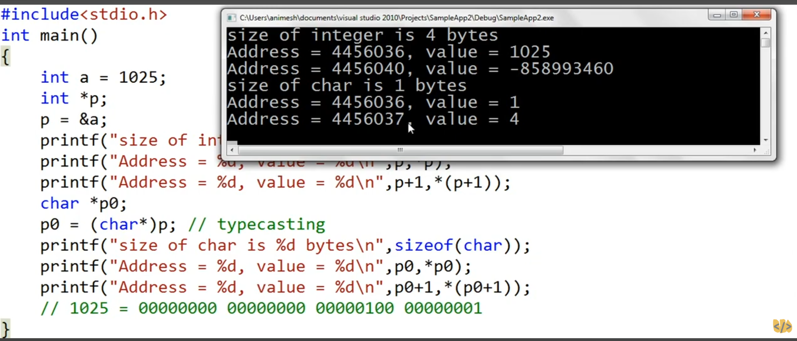
  <br>
  <sub>Screenshot supplied for these learning notes. It includes an invalid read that I explain below. The original lesson image is not my own work.</sub>
</p>

### Start with what has not changed

```c
int a = 1025;
int *p = &a;
char *p0 = (char *)p;
```

`a` is still an integer holding 1025. `p` points to that integer. The cast `(char *)p` gives us a character pointer to the first byte of the same object.

**The cast does not change 1025 into 1. It does not create another integer or change the bytes stored in a. It changes the pointer type through which we look at those bytes.**

Both pointers start at the same object. Reading `*p` gives the integer value. Reading `*p0` gives the value of its first byte through a character type.

### One integer can occupy several bytes

The screenshot's system uses 4 bytes for an `int`. Each byte has 8 bits on that system.

1025 can be written as:

```text
1025 = 1024 + 1
     = 4 × 256 + 1
```

In four groups of eight bits, that is:

```text
00000000  00000000  00000100  00000001
```

Those groups have values 0, 0, 4 and 1 when written with the most significant group first, as above. But that written order is not necessarily the order of bytes at increasing memory addresses.

### Why does the first byte contain 1?

The byte results shown in the picture match **little endian** storage. That means the least significant byte goes at the lowest address. Here that is the byte containing 1.

For a 4 byte integer with 8 bit bytes on such a system, the layout of 1025 is:

| Position in memory | Byte in binary | Byte value |
| --- | --- | --- |
| First byte | `00000001` | 1 |
| Second byte | `00000100` | 4 |
| Third byte | `00000000` | 0 |
| Fourth byte | `00000000` | 0 |

So `*p0` reads 1 and `*(p0 + 1)` reads 4. The integer is not broken. We are looking at one piece of its stored representation at a time.

When we read `*p`, the system reads the object as an integer using its integer representation. For this layout, the value is:

```text
1 + (4 × 256) + (0 × 65536) + (0 × 16777216) = 1025
```

On a typical big endian system with the same integer size and byte size, those bytes would appear as 0, 0, 4 and 1 at increasing addresses. C does not require every system to use the same byte order or a 4 byte `int`.

### Why does p + 1 move by 4 but p0 + 1 move by 1?

This is the step size from Part 2 again.

`p` has type `int *`, so `p + 1` moves by one `int`. On the screenshot's system, that covers 4 bytes. `p0` has type `char *`, so `p0 + 1` moves by one character, which is one C byte.

| Expression | Meaning in this example |
| --- | --- |
| `p` | Pointer to the integer a |
| `*p` | Integer value 1025 |
| `p + 1` | Position just past the single integer a |
| `p0` | Pointer to the first byte of a |
| `*p0` | First byte read as a char |
| `p0 + 1` | Pointer to the second byte of a on this system |
| `*(p0 + 1)` | Second byte read as a char |

The step size depends on the type being pointed to. It does not depend on the size of the pointer variable itself. `sizeof(int)` measures an integer while `sizeof(p)` measures the pointer variable. Those answer different questions.

`sizeof(char)` is always 1 in C. The number of bits in that byte is given by `CHAR_BIT` from `<limits.h>`. It is 8 on the system illustrated here but C does not require that on every system.

### What is that strange negative value?

The screenshot also reads:

```c
*(p + 1)  // Invalid here: a is one integer, not an array of two integers.
```

Forming `p + 1` is allowed because it is the position just past `a`. Reading through it is not allowed. There is no next integer element belonging to this object.

**The value -858993460 is not an answer we should learn or expect. The program has undefined behavior at this read.** That means C does not promise a result. A program might print something, crash or behave differently after a small change.

It is tempting to call this “the value of the next variable” or just “garbage.” Neither explains the real problem. We are reading somewhere this pointer is not allowed to read. The observed number does not make that access valid.

The screenshot also prints pointers with `%d`. That format expects an `int`, so those calls are incorrect too. Use `%p` with a `void *` argument for a pointer and `%zu` for a `sizeof` result. Because the original program contains invalid operations, its output is an illustration of the intended lesson rather than a reliable test.

### Why use unsigned char for the corrected example?

C allows an object's stored bytes to be inspected through a character type. This is a specific rule; casting to any unrelated pointer type does not give us permission to read through it.

I use `unsigned char *` below because it reads each byte as a nonnegative value. Plain `char` can be signed or unsigned depending on the implementation. The values 1 and 4 do not expose that difference but other byte values can.

I also stop after `sizeof(a)` bytes so every byte read belongs to `a`.

### A corrected example

```c
#include <limits.h>
#include <stdio.h>

int main(void)
{
    int a = 1025;
    int *p = &a;
    unsigned char *bytes = (unsigned char *)p;

    printf("Integer value: %d\n", *p);
    printf("Integer size: %zu bytes\n", sizeof(a));
    printf("Bits per byte: %d\n", CHAR_BIT);
    printf("Pointer to a: %p\n", (void *)p);

    for (size_t i = 0; i < sizeof(a); i++)
    {
        printf("Byte %zu at %p has value %u\n",
               i, (void *)(bytes + i), (unsigned int)bytes[i]);
    }

    printf("Integer after reading its bytes: %d\n", a);
    return 0;
}
```

On a usual little endian system with 4 byte integers and 8 bit bytes, the byte values will be **1, 4, 0 and 0**. The printed addresses will vary. The integer is still 1025 after the loop because we only read its bytes.

`bytes[i]` means the same thing as `*(bytes + i)`. Both select one byte at position `i`. The cast to `unsigned int` in the print call matches the `%u` format.

The main idea I want to keep is this: **the object stays the same. The pointer type decides whether I access it as an integer or inspect one of its bytes. I still have to stay inside the allowed memory range.**

For the C rule behind byte access, see the character pointer discussion in [WG14's pointer issues paper](https://open-std.org/jtc1/sc22/wg14/www/docs/n2222.htm), which quotes C 6.3.2.3 paragraph 7. The byte layout above explains the supplied screenshot; it is not a promise that every machine stores integers that way.

## Part 4: A pointer can point to another pointer

In Part 1, I said a pointer is also a variable with its own address. Now that idea becomes useful. If a pointer has an address, another pointer can store that address.

<p align="center">
  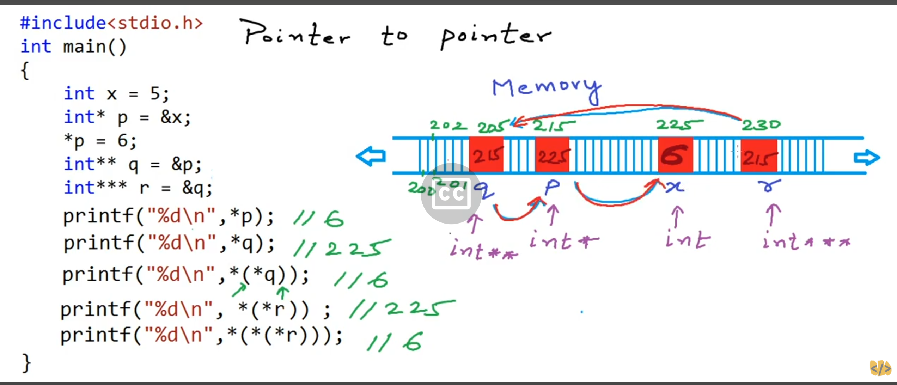
  <br>
  <sub>Screenshot supplied for these learning notes. The addresses are teaching examples. The original illustration is not my own work.</sub>
</p>

### Start with x and p

```c
int x = 5;
int *p = &x;
*p = 6;
```

`x` starts with the value 5. `p` stores the address of `x`. When I write `*p = 6`, I follow that pointer and change `x` to 6.

So at this point, `x` and `*p` both give me 6 when I read them. I have one integer object, not two copies of 6.

### Now point to p

```c
int **q = &p;
```

What am I giving `q`? The address of `p`, not the address of `x`.

Since `p` has type `int *`, its address has type `int **`. That is the matching type for `q`. Read the declaration as **q is a pointer to a pointer to int**.

Now follow it slowly:

| Expression | What I reach | Type |
| --- | --- | --- |
| `q` | The stored address of p | `int **` |
| `*q` | The pointer variable p | `int *` |
| `**q` | The integer x through p | `int` |

Reading `*q` gives the pointer value stored in `p`, which is `&x`. Reading `**q` follows that pointer too and gives the integer value 6.

**One star follows one pointer. A second star follows the next pointer.**

### One more level with r

```c
int ***r = &q;
```

`r` stores the address of `q`. Since `q` has type `int **`, its address has type `int ***`.

The chain is **r points to q, q points to p and p points to x**.

| Expression | What I reach | Type |
| --- | --- | --- |
| `r` | The stored address of q | `int ***` |
| `*r` | The pointer variable q | `int **` |
| `**r` | The pointer variable p through q | `int *` |
| `***r` | The integer x through p | `int` |

I do not need to memorize the final value. I can follow each pointer in order. Start at `r`, reach `q`, then reach `p` and finally reach `x`.

The stars in `int ***r` declare its type. The stars in the expression `***r` follow the pointers. That is the same declaration versus dereferencing distinction from Part 1.

### Read the addresses in the picture

The drawing gives `x` the example address 225, `p` the address 215, `q` the address 205 and `r` the address 230.

| Variable | Its own illustrated address | What it stores |
| --- | --- | --- |
| `x` | 225 | Integer value 6 |
| `p` | 215 | Address of x, illustrated as 225 |
| `q` | 205 | Address of p, illustrated as 215 |
| `r` | 230 | Address of q, illustrated as 205 |

There is a mistake in the drawing: the box for `r` appears to contain 215. For the written declaration `int ***r = &q;`, it should contain the address of `q`, which the drawing labels 205. The address 215 belongs to `p`.

These numbers only help us follow the connections. They do not show real sizes, alignment or an address order that C promises for local variables.

### Walk through the five print statements

The picture prints five expressions. After `*p = 6`, here is what each one means:

| Expression | Steps | Result when read |
| --- | --- | --- |
| `*p` | Follow p to x | 6 |
| `*q` | Follow q to p and read p | Pointer to x |
| `*(*q)` | Follow q to p, then p to x | 6 |
| `*(*r)` | Follow r to q, then q to p and read p | Pointer to x |
| `*(*(*r))` | Follow r to q, then q to p, then p to x | 6 |

`*(*q)` is another way to write `**q`. Likewise, `*(*r)` is `**r` and `*(*(*r))` is `***r`. The parentheses just make the steps easier to see.

The results for `*q` and `**r` are pointers, not integers. In the drawing, they both identify address 225. In real C code, print them with `%p` and a cast to `void *`. The screenshot uses `%d` for those pointers, which is incorrect. Use `%d` for the integer results.

### Changing the value and changing the destination are different

If I write:

```c
**q = 9;
```

I reach `x` and change its value to 9. I could reach the same integer through `***r` too.

But this does something else:

```c
int y = 20;
*q = &y;
```

`*q` is the pointer variable `p`. So this assignment changes `p` to point to `y` instead of `x`. It does not change `x` into 20.

The chain now ends at `y`. `q` still points to `p` and `r` still points to `q`. Reading `*p`, `**q` or `***r` now gives 20. The old integer `x` stays at 9.

This is one reason pointers to pointers are useful: they let us access and change a pointer variable itself. For example, a function can receive the address of a caller's pointer when it needs to update where that pointer points.

### A corrected example

```c
#include <stdio.h>

int main(void)
{
    int x = 5;
    int *p = &x;
    *p = 6;
    int **q = &p;
    int ***r = &q;

    printf("*p    = %d\n", *p);
    printf("*q    = %p\n", (void *)*q);
    printf("**q   = %d\n", **q);
    printf("**r   = %p\n", (void *)**r);
    printf("***r  = %d\n", ***r);

    **q = 9;
    printf("After **q = 9, x = %d\n", x);

    int y = 20;
    *q = &y;
    printf("After *q = &y, x = %d and *p = %d\n", x, *p);
    printf("The chain now reaches y: ***r = %d\n", ***r);

    return 0;
}
```

The first, third and fifth lines print 6. The second and fourth lines print the same pointer value, which points to `x` at that moment. The addresses will vary between runs.

After changing the value through `**q`, `x` becomes 9. After changing the pointer through `*q`, `p` points to `y` and the chain reads 20.

Every pointer in the chain must lead to a valid live object before we follow it. More stars do not make an invalid pointer usable. In this example, `x`, `p`, `q` and `y` remain alive while the code uses them.

What I want to remember is: **count the steps and check the type at each step. Stop at p to change its destination. Go through p to change the integer it points to.**

## Part 5: Passing values, passing addresses and stack frames

Suppose I have `a = 10` in `main` and I want another function to increase it. I call the function but the value is still 10 when I return. Why?

The first thing to check is what I gave the function: **a copy of the number or a copy of its address?**

### Passing the number gives the function its own copy

<p align="center">
  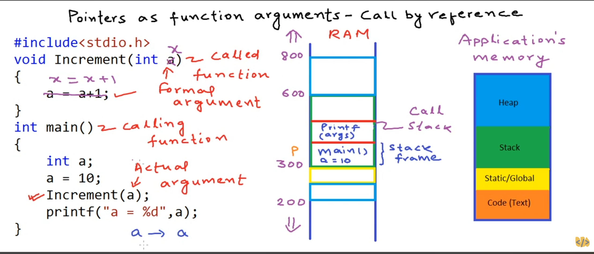
  <br>
  <sub>Screenshot supplied for these learning notes. The memory drawing is a teaching model rather than a fixed layout required by C.</sub>
</p>

Here is the first version. I name the parameter `x` so we can easily tell it apart from `a`:

```c
void IncrementValue(int x)
{
    x = x + 1;
}

/* Inside main: */
int a = 10;
IncrementValue(a);
```

At the call, C reads the value of `a`, which is 10. The function's parameter `x` receives that value. **There are now two separate integer objects: a in main and x in IncrementValue.**

When the function writes `x = x + 1`, it changes its own `x` to 11. It has not written to `a`. After the function returns, `a` is still 10.

| Moment | a in main | x in IncrementValue |
| --- | --- | --- |
| Before the call | 10 | No active parameter yet |
| Function begins | 10 | 10 |
| After `x = x + 1` | 10 | 11 |
| Function returns | 10 | Its lifetime has ended |

Using the name `a` for the parameter would not change this behavior. Two local variables with the same name in different functions do not become the same variable.

In the call `IncrementValue(a)`, `a` is the argument expression. In `void IncrementValue(int x)`, `x` is the parameter that receives the value. The screenshot calls these the actual argument and formal argument.

### What is a stack frame?

Think of a stack frame as temporary working space for one active function call. On many systems, a call uses a frame on the call stack to keep information it needs while running.

Depending on the machine and compiler, that information can include local variables, saved register values, arguments and the information needed to return to the caller. Some of it may stay in CPU registers instead of being placed in memory.

A simple way to follow our example is:

1. `main` is running and its variable `a` is alive.
2. `main` calls `IncrementValue`. The new call has its own parameter `x`.
3. `main` has not finished. Its execution waits for the call to return while `a` remains alive.
4. `IncrementValue` finishes. Its parameter `x` stops being a live object and its temporary call storage can be reused.
5. Execution continues in `main` after the call. Its own `a` is still 10.

This is why a stack is often compared to a pile of plates. For ordinary nested calls, the most recent call finishes before the caller resumes. Calling a function does not replace the caller's variables with the new function's variables.

The second screenshot shows a `printf` call above `main`. That represents a later moment when `Increment` has returned and `main` is printing its result. In this simple model, there is no active `Increment` frame at that moment.

**The separate variables explain the result. The stack drawing helps us picture it.** C does not require every function to have a visible stack frame or every local variable to live on the stack. A compiler can keep values in registers, inline a call or remove work that has no observable effect. The copy behavior of the parameter still applies.

### Passing the address lets the function reach the original

<p align="center">
  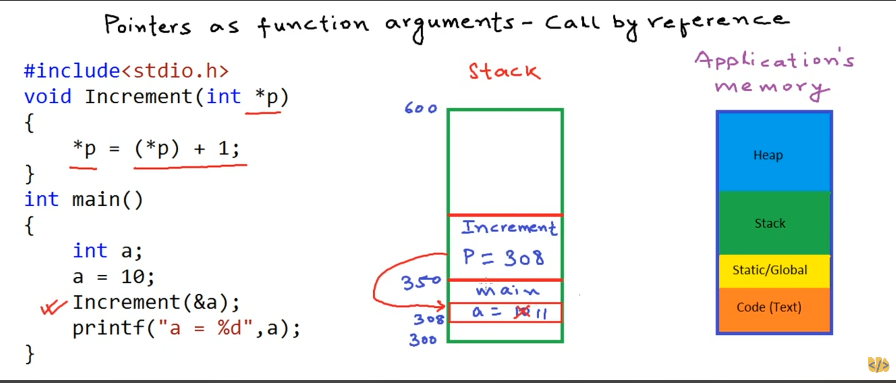
  <br>
  <sub>The pointer parameter belongs to the called function but points to the caller's integer. The illustrated addresses are examples.</sub>
</p>

Now I change the parameter to a pointer and pass `&a`:

```c
void IncrementAddress(int *p)
{
    *p = *p + 1;
}

/* Inside main: */
int a = 10;
IncrementAddress(&a);
```

`&a` gives the address of `a`. The function receives a copy of that pointer value in its own parameter `p`.

The screenshot uses 308 as an example address for `a`. Its pointer parameter stores 308. The actual address on your machine will differ but the relationship is the same: **p points to the original a in main**.

Now follow the assignment:

```c
*p = *p + 1;
```

On the right side, `*p` reads the integer at that address, which is 10. Adding 1 produces 11. On the left side, `*p` identifies where to store the result. It is still the original `a`.

When the function returns, the local pointer parameter `p` stops being alive. But `a` belongs to the still active call to `main`, so it remains alive with its new value of 11.

| Moment | a in main | p in IncrementAddress |
| --- | --- | --- |
| Before the call | 10 | No active parameter yet |
| Function begins | 10 | Holds a pointer to a |
| After `*p = *p + 1` | 11 | Still points to a |
| Function returns | 11 | Its lifetime has ended |

### Is this pass by reference?

The screenshot calls this “call by reference.” You will hear that phrase used to describe changing a caller's variable through its address.

**Strictly speaking, C always passes arguments by value.** In the first version, the copied value is an integer. In the second version, the copied value is a pointer. C does not have a separate reference parameter feature like C++.

The pointer parameter is still a separate variable. It just provides a way to reach another object. That is how we get the effect people often call pass by reference in C.

| Call | Parameter | What gets copied | Effect of the shown assignment |
| --- | --- | --- | --- |
| `IncrementValue(a)` | `int x` | Integer value 10 | `x = x + 1` changes only x |
| `IncrementAddress(&a)` | `int *p` | Pointer to a | `*p = *p + 1` changes a |

### Changing p is different from changing *p

Suppose the caller already has a pointer:

```c
int a = 10;
int *caller_p = &a;
IncrementAddress(caller_p);
```

`caller_p` and the parameter `p` are separate pointer variables. They hold pointer values that lead to the same integer. Writing through `*p` changes that shared integer.

Assigning a different address to the local parameter `p` would change only that parameter. It would not redirect `caller_p`. To let a function change `caller_p` itself, we would pass `&caller_p` to a matching `int **` parameter. That connects this lesson to Part 4.

Also keep these expressions separate:

| Expression | What changes |
| --- | --- |
| `*p = *p + 1` | The integer pointed to by p |
| `(*p)++` | The integer pointed to by p |
| `p++` | The local pointer p moves by one element |

### What happens to local storage after a function returns?

Ending a function does not promise that its old bytes are immediately erased. The important point is that its ordinary local objects are no longer alive. Their old storage can be reused.

So do not return a pointer to an ordinary local variable and expect to use it later:

```c
/* Incorrect example. Do not use the returned pointer. */
int *BadPointer(void)
{
    int temporary = 10;
    return &temporary;
}
```

`temporary` stops being alive when this function returns. The returned pointer does not keep it alive. This differs from our increment example, where `a` belongs to the caller and stays alive throughout the call.

### What about the other memory boxes in the pictures?

The diagrams also show code, static/global storage and a heap. These labels describe a common way to organize program memory:

| Area | Basic idea |
| --- | --- |
| Code | The machine instructions the program executes |
| Static/global storage | Objects such as global variables and static local variables that last for the program's execution |
| Stack | Commonly used for active calls and their temporary working storage |
| Heap | Commonly used for dynamic allocation such as memory obtained with malloc |

Neither increment example uses dynamic allocation. Taking `&a` does not move `a` to the heap or make it last longer.

The exact order, addresses and growth directions in those pictures are not rules of C. On an embedded target, the linker configuration and platform decide the memory layout. A stack frame is also not the same thing as the entire stack; it is the working area associated with one call in this model.

### Compare both calls in one program

```c
#include <stdio.h>

void IncrementValue(int x)
{
    x = x + 1;
    printf("Inside IncrementValue: x = %d\n", x);
}

void IncrementAddress(int *p)
{
    *p = *p + 1;
    printf("Inside IncrementAddress: *p = %d\n", *p);
}

int main(void)
{
    int a = 10;

    IncrementValue(a);
    printf("After passing the value: a = %d\n", a);

    IncrementAddress(&a);
    printf("After passing the address: a = %d\n", a);

    return 0;
}
```

The output is:

```text
Inside IncrementValue: x = 11
After passing the value: a = 10
Inside IncrementAddress: *p = 11
After passing the address: a = 11
```

The address version requires a valid pointer to a live integer that it is allowed to modify. It does not check for a null pointer. The example meets that requirement by passing `&a`.

A function can also return a new integer for the caller to assign. Pointers are useful when we want to update an existing object through its address, but they are not the only way to send a result back.

My rule to remember is: **a function receives a copied value. If that value is a pointer, it can use the pointer to reach the original object. The pointer parameter's lifetime and the pointed object's lifetime are separate.**

## Part 6: Pointers and arrays

One shortcut I use is “the array name gives me a pointer.” It helps me remember that I can pass `A` to a function expecting a pointer to its first element. I do not need to write `&A` for that call.

But I want to keep the exact rule clear: **an array is not a pointer variable. In most expressions, the array converts to a pointer to its first element.** People often call this array decay.

### First, look at the elements in memory

<p align="center">
  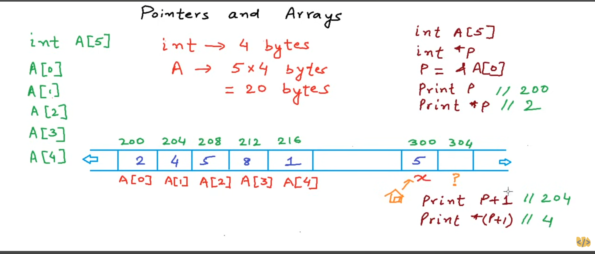
  <br>
  <sub>Supplied lesson screenshot. The addresses assume 4 byte integers for illustration. The original drawing is not my own work.</sub>
</p>

The picture shows these values:

```c
int A[5] = {2, 4, 5, 8, 1};
int *p = &A[0];
```

`A` is one array containing five integer elements. Those elements are stored next to each other. `p` is a separate pointer variable holding the address of the first element.

The drawing starts the array at the example address 200. If each integer takes 4 bytes, the elements begin at 200, 204, 208, 212 and 216. The whole array takes `5 * sizeof(int)` bytes, which is 20 bytes on that illustrated system.

So reading `*p` gives 2. Reading `*(p + 1)` gives 4. One step through this `int *` moves by one integer, just as we saw in Part 2.

The statement `int A[5];` alone would not initialize a local array with those five values. I have written the values explicitly above to match the drawing.

### Why can I write p = A?

<p align="center">
  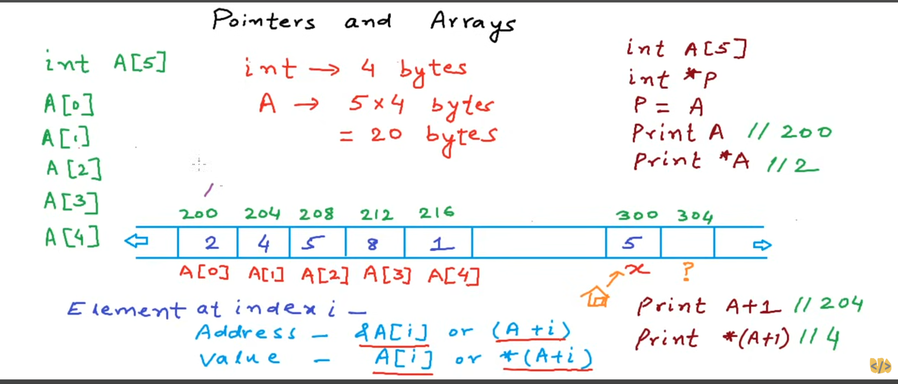
  <br>
  <sub>The second screenshot connects array indexing to pointer arithmetic.</sub>
</p>

These two initializations give `p` the same pointer value:

```c
int *p = &A[0];
```

```c
int *p = A;
```

They are alternatives, not two declarations to put in the same scope. In the second one, `A` converts to a pointer to its first element. That pointer has type `int *`, matching `p`.

**Passing A does not copy all five integers. It supplies a pointer to the first one.** The array still exists in its original place.

### A[i] is an element, not its address

Take index 2:

```c
A[2]      // The third integer element. Reading it gives 5.
&A[2]     // A pointer to that third element.
```

`A[2]` identifies an actual integer object inside the array. We can read it, assign to it or take its address. Writing `&(A[2])` means the same thing as `&A[2]`.

The index counts from zero. Index 0 is the first element and index 4 is the fifth element.

| Expression | Meaning for this array |
| --- | --- |
| `A` in a pointer expression | Pointer to the first element |
| `&A[0]` | Pointer to the first element |
| `A + 2` | Pointer to the third element |
| `&A[2]` | Pointer to the third element |
| `A[2]` | The third element, initially 5 |
| `*(A + 2)` | The same third element |

For a valid element index `i`, **`A[i]` means `*(A + i)`**. The address of that element is `&A[i]`, which is also `A + i`.

For this five element array, use indices 0 through 4 when accessing an element. `A + 5` is the allowed position just past the array but it must not be dereferenced.

### What happens when I pass these to a function?

Let me use two small functions:

```c
void ChangeValue(int value)
{
    value = 99;
    (void)value;  // This demonstration deliberately discards the local copy.
}

void ChangeElement(int *element)
{
    *element = 99;
}
```

Now compare the calls, starting with our original array:

```c
ChangeValue(A[2]);      // Copies 5 into value. A[2] stays 5.
ChangeElement(&A[2]);   // Copies its address. A[2] becomes 99.
ChangeElement(A);       // Copies the first element's address. A[0] becomes 99.
```

The first function gets a copy of an integer. The second gets a copy of a pointer. Both calls still use C's pass by value rule. The difference is that a copied pointer lets the function reach the original element.

For `ChangeElement(A)`, no `&` is needed because the array expression already converts to the pointer the parameter expects.

### Then what does &A mean?

`&A` is valid C. It takes the address of the whole array. It does not have the same type as a pointer to one integer.

```c
int *first = A;
int (*whole)[5] = &A;
```

Read the second declaration as **whole is a pointer to an array of five integers**. The parentheses matter. `int *whole[5]` would instead declare an array of five pointers.

| Expression | Pointer type | One step forward |
| --- | --- | --- |
| `A` after conversion | `int *` | One integer |
| `&A[0]` | `int *` | One integer |
| `&A` | `int (*)[5]` | One whole array of five integers |

The array and its first element begin at the same memory location. That does not make their pointer types interchangeable. `first + 1` points to the second integer while `whole + 1` points just past the whole array. Do not dereference that last pointer here.

For a function expecting `int *`, pass `A` or `&A[0]`. Passing `&A` gives it the wrong pointer type. You would use `&A` with an interface that specifically expects a pointer to that whole array type.

### Why is an array not just a pointer variable?

Two differences make this easier to see:

```c
int A[5] = {2, 4, 5, 8, 1};
int *p = A;

p++;  // Valid here. p now points to A[1].
/* A++; */  // Invalid. An array is not a pointer variable we can advance.
```

Moving `p` changes a stored pointer. It does not move the array or change its name.

Also, where `A` is the actual array object:

```c
sizeof(A)  // Size of all five integers.
sizeof(p)  // Size of the pointer variable.
```

`sizeof(A)` and `&A` are important cases where the array does not convert to a pointer to its first element. That is why “the array name is always a pointer” would lead us to wrong answers.

### Pass the length when the function needs it

A function receiving `int *` does not automatically receive the number of elements available through that pointer. For a function that processes a variable number of elements, pass the count separately.

```c
void PrintArray(const int values[], size_t count);
```

In a function parameter declaration, `const int values[]` is adjusted to `const int *values`. It does not mean the entire array is copied into the function. `const` prevents this function from changing the elements through `values`.

Inside that function, `sizeof(values)` would measure a pointer. It would not recover the caller's array size.

Calculate the count where the real array is available:

```c
size_t count = sizeof(A) / sizeof(A[0]);
```

For our array, this divides the size of five integers by the size of one integer and gives 5. This formula does not work as an array count if `A` is actually a pointer parameter.

### A complete example

```c
#include <stdio.h>

void ChangeValue(int value)
{
    value = 99;
    printf("Inside ChangeValue: value = %d\n", value);
}

void ChangeElement(int *element)
{
    *element = 99;
}

void PrintArray(const int values[], size_t count)
{
    for (size_t i = 0; i < count; i++)
    {
        printf("%d%s", values[i], i + 1 == count ? "\n" : " ");
    }
}

int main(void)
{
    int A[5] = {2, 4, 5, 8, 1};
    int *p = A;
    int (*whole)[5] = &A;
    size_t count = sizeof(A) / sizeof(A[0]);

    printf("*p = %d and *(p + 1) = %d\n", *p, *(p + 1));
    printf("Whole array size: %zu bytes\n", sizeof(*whole));

    ChangeValue(A[2]);
    printf("After passing the value: A[2] = %d\n", A[2]);

    ChangeElement(&A[2]);
    printf("After passing its address: A[2] = %d\n", A[2]);

    ChangeElement(A);
    printf("After passing A: A[0] = %d\n", A[0]);
    PrintArray(A, count);

    return 0;
}
```

The first call leaves `A[2]` at 5. The address call changes it to 99. Passing `A` to `ChangeElement` then changes the first element to 99. The final array is:

```text
99 4 99 8 1
```

In my display driver, the same idea applies to the `pins` array. Passing `pins` supplies a pointer to its first `seven_seg_pin` entry. The driver expects seven entries because that is part of its interface, not because the pointer carries a length.

My shortcut is now more precise: **use A to pass the first element's address, A[i] to pass an element's value and &A[i] to pass that element's address. Remember that the array itself is still an array.**

## Part 7: Why sizeof cannot find the array length inside this function

These two examples look almost the same. Both try to add 1, 2, 3, 4 and 5. But the first calculates the length in the wrong place while the second passes the length from `main`.

The important question is: **at this line of code, does A name an actual array or a pointer parameter?**

### The first version measures a pointer

<p align="center">
  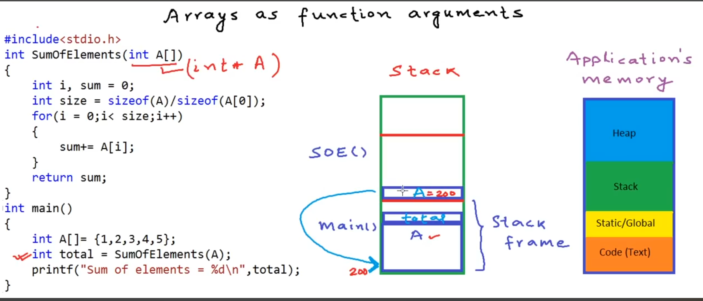
  <br>
  <sub>Supplied lesson screenshot. The function receives a pointer to the existing array rather than a copy of all its elements.</sub>
</p>

In `main`, we have a real array:

```c
int A[] = {1, 2, 3, 4, 5};
```

Here the compiler knows that `A` contains five integers. `sizeof(A)` gives the size of that entire array. If each integer takes 4 bytes, that is 20 bytes.

Then we call:

```c
SumOfElements(A);
```

For this call, the array expression converts to a pointer to its first element. The function receives a copy of that pointer value. It does not receive an extra copy of the five integers or an automatic length field.

### Why int A[] in the parameter list is a pointer

These two declarations describe the same parameter type:

```c
int SumOfElements(int A[]);
int SumOfElements(int *A);
```

In a function parameter list, C adjusts `int A[]` to `int *A`. The brackets make the intended use easier to read but they do not create a local array.

That is what I want to notice in the stack drawing: **main owns the five element array. SumOfElements has a pointer parameter called A that leads to its first element.** The two uses of the name `A` do not refer to the same local variable.

The function can access the elements through that pointer while the caller's array is alive. The compiler might keep the pointer in a register rather than a stack slot, so the drawing is a simple way to picture the call. The parameter is a pointer either way.

### Look closely at the failed calculation

Inside the first function, the screenshot writes:

```c
int size = sizeof(A) / sizeof(A[0]);  // Wrong place to calculate the array length.
```

Since `A` is a pointer parameter here, this is effectively:

```c
sizeof(int *) / sizeof(int)
```

It divides the size of a pointer by the size of an integer. That does not tell us how many integers the pointer can reach.

| Example platform sizes | Calculation inside the function | Incorrect count |
| --- | --- | --- |
| Pointer is 4 bytes and int is 4 bytes | `4 / 4` | 1 |
| Pointer is 8 bytes and int is 4 bytes | `8 / 4` | 2 |

In the first case, the loop adds only `A[0]` and returns 1. In the second case, it adds `A[0]` and `A[1]` and returns 3. Neither result is the intended 15.

**A pointer to int does not have to be the same size as an int.** The `int` in `int *` tells us what kind of object the pointer points to. It does not say the pointer itself takes 4 bytes.

`sizeof(A[0])` still measures an integer because indexing through this pointer produces an integer element. For this ordinary `int` expression, `sizeof` determines its size from the type without reading an element at runtime. It does not search memory for the end of the array.

This wrong formula can also produce a count that goes beyond a smaller array. An incorrect count is not just a wrong total; it can lead to an invalid read.

### Why the second version works

<p align="center">
  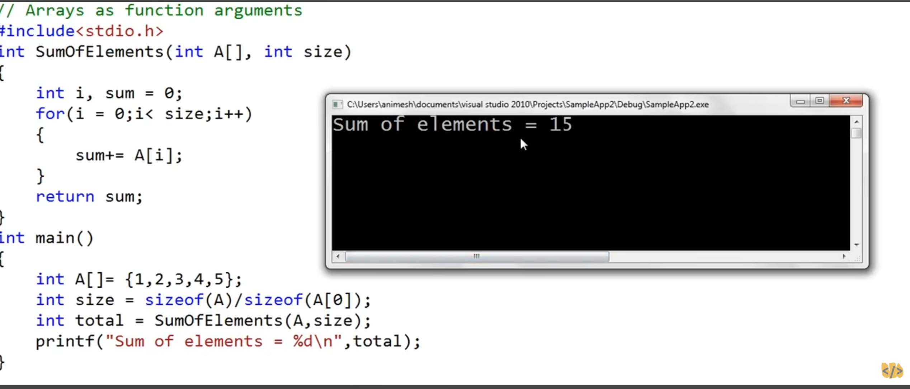
  <br>
  <sub>The caller supplies both the starting pointer and the number of elements.</sub>
</p>

The second version calculates the length in `main`, where `A` is still the actual array:

```c
size_t size = sizeof(A) / sizeof(A[0]);
```

For five 4 byte integers, this gives `20 / 4`, which is 5. If the size of an integer differs on another system, the ratio still gives five because both sizes refer to the same element type.

Now we pass two values:

```c
int total = SumOfElements(A, size);
```

The pointer tells the function **where to start**. The count tells it **how many elements to use**. Both argument values are copied into their parameters.

| Iteration | Element added | Running sum |
| --- | --- | --- |
| 0 | 1 | 1 |
| 1 | 2 | 3 |
| 2 | 3 | 6 |
| 3 | 4 | 10 |
| 4 | 5 | 15 |

The loop stops when the index reaches 5, so it never reads `A[5]`.

### A complete version

```c
#include <stdio.h>

int SumOfElements(const int A[], size_t count)
{
    int sum = 0;

    for (size_t i = 0; i < count; i++)
    {
        sum += A[i];
    }

    return sum;
}

int main(void)
{
    int A[] = {1, 2, 3, 4, 5};
    size_t count = sizeof(A) / sizeof(A[0]);
    int total = SumOfElements(A, count);

    printf("Number of elements = %zu\n", count);
    printf("Sum of elements = %d\n", total);
    return 0;
}
```

The output is:

```text
Number of elements = 5
Sum of elements = 15
```

I use `size_t` for the count because it is the type returned by `sizeof`. `const int A[]` becomes a pointer to const int in this parameter list. It lets the function read the elements without changing them through `A`.

The caller must supply a correct count. C does not automatically stop this loop at the array boundary if we pass a larger number. The example's sum also fits in an `int`; a function meant for arbitrary inputs would need to handle possible overflow.

### Writing a number in the parameter brackets does not fix it

This declaration still has a pointer parameter:

```c
int SumOfElements(int A[5]);
```

The plain `[5]` does not make `sizeof(A)` inside the function measure five integers. It also does not automatically check the caller's length. For this interface, pass the count explicitly.

The rule I want to keep is: **calculate the length where the actual array is available. Pass the pointer and the count to the function. Do not use sizeof on a pointer to guess how many elements it points to.**

## Part 8: A two dimensional array is an array of rows

Things become more interesting here. Let me start with this example:

```c
int arr[2][3] = {
    {1, 2, 3},
    {3, 4, 5}
};
```

This is an array with two elements at the outer level. Each of those elements is itself an array of three integers. I will call those inner arrays rows.

`arr[0]` is the first row, containing 1, 2 and 3. `arr[1]` is the second row, containing 3, 4 and 5. The rows are stored next to each other with the first row's elements followed by the second row's elements.

### First, fix the print formats

Here is my original question written with the correct formats:

```c
printf("arr   = %p\n", (void *)arr);
printf("*arr  = %p\n", (void *)*arr);
printf("**arr = %d\n", **arr);
```

The first two expressions supply pointers in these calls, so I use `%p` with a cast to `void *`. The last expression supplies an integer, so `%d` is correct there. Printing the first two with `%d` is a format mismatch and makes the program's behavior undefined.

The first two pointer values identify the same starting location. The last line prints **1**. Let me explain why that happens without saying that all three expressions mean the same thing.

### What does arr give me?

<p align="center">
  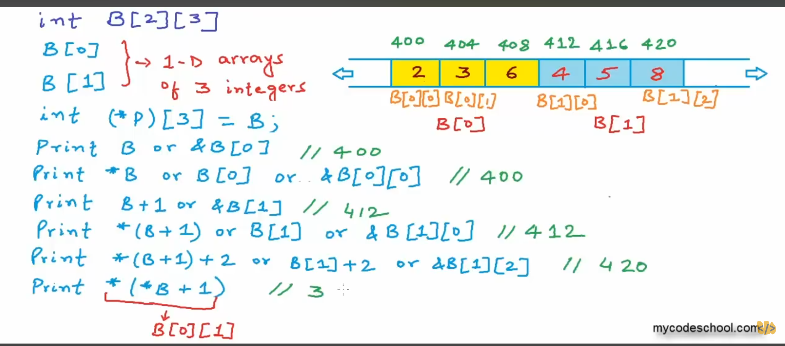
  <br>
  <sub>Supplied mycodeschool lesson screenshot. Its B array has different values from my arr example but the same two row structure.</sub>
</p>

In most expressions, an array converts to a pointer to its first element. Here the first element is **a whole row of three integers**.

So `arr` converts to a pointer to a row. Its resulting pointer type is `int (*)[3]`. I can store it like this:

```c
int (*p)[3] = arr;
```

Read that as **p is a pointer to an array of three integers**. The parentheses matter. `int *p[3]` would instead declare an array of three pointers.

`p` points to row zero. It does not hold a copied row or a separate list of pointers to the rows.

### What does *arr give me?

The expression `*arr` follows the pointer to the first row. At this step, **the result is an array of three integers**, just like `arr[0]`.

When I use that row in the print expression, it also converts to a pointer to its own first element. That element is now one integer, `arr[0][0]`. This second conversion produces an `int *`.

So there are two different steps:

1. `arr` converts to a pointer to the first row.
2. `*arr` selects that row, which can then convert to a pointer to its first integer.

This is why the addresses start at the same place. The first row starts at the beginning of the outer array and the first integer starts at the beginning of that row. **It is not a coincidence, but the types are different.**

I would not write `arr = *arr` as code or use it as a type rule. The array is not assignable and the two expressions have different roles. We are comparing their starting locations, not saying they are interchangeable.

### What does **arr give me?

The first star selects the first row. That row converts to a pointer to its first integer when used with the next star. The second star accesses that integer.

```c
**arr      // Same integer element as arr[0][0]. Its value is 1.
```

There are two stars because we go through the row level and then the integer level. This does not make the original array a pointer to pointer.

| Expression | What it selects | Type before any further array conversion |
| --- | --- | --- |
| `arr` | The whole array | `int [2][3]` |
| `*arr` or `arr[0]` | The first row | `int [3]` |
| `**arr` or `arr[0][0]` | The first integer | `int` |

In the print calls, the first two array expressions convert to pointers. The final integer expression supplies the value 1.

### Same start does not mean the same step size

Suppose an integer takes 4 bytes. One row contains three integers, so a row takes 12 bytes.

| Expression | Where it points | Step from the beginning |
| --- | --- | --- |
| `arr` after conversion | First row | 0 bytes |
| `arr + 1` | Second row | 12 bytes |
| `*arr` after conversion | First integer in the first row | 0 bytes |
| `*arr + 1` | Second integer in the first row | 4 bytes |

The pointer type tells C how large one step is. `arr + 1` steps over a row. `*arr + 1` steps over one integer inside the first row.

The screenshot illustrates this with address 400 for the first row and 412 for the second row. Those are teaching addresses under the 4 byte integer assumption. Real addresses and integer sizes may differ.

### Follow arr[i][j] one step at a time

<p align="center">
  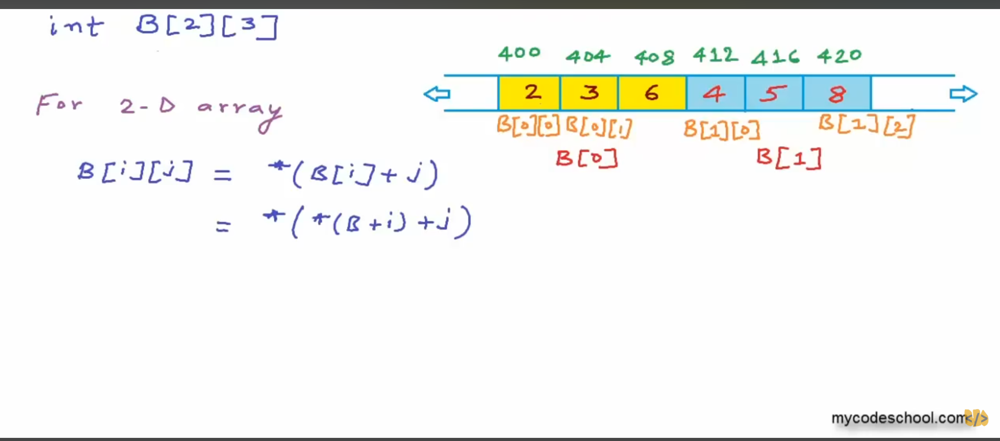
  <br>
  <sub>The same indexing rule applies to my arr array. First choose a row, then choose an element within it.</sub>
</p>

The second image shows these equivalent ways to access an element:

```c
arr[i][j]
*(arr[i] + j)
*(*(arr + i) + j)
```

Let me use `arr[1][2]`, whose value in my example is 5:

| Step | What happens |
| --- | --- |
| `arr + 1` | Move to the second row |
| `*(arr + 1)` | Select the second row, the array `{3, 4, 5}` |
| `*(arr + 1) + 2` | That row converts to an int pointer and we move to its third element |
| `*(*(arr + 1) + 2)` | Read that element, which is 5 |

The address of this element is `&arr[1][2]`, also written as `*(arr + 1) + 2`. Add the final star when you want to access the integer at that address.

This is the same indexing rule from a one dimensional array applied twice. I do not have to memorize the long expression if I can follow the row step and the element step.

### Keep the screenshot's values separate from my example

The picture uses `B = {{2, 3, 6}, {4, 5, 8}}`. My code uses `arr = {{1, 2, 3}, {3, 4, 5}}`.

So `*(*B + 1)` in the picture gives 3, but `*(*arr + 1)` in my code gives 2. Both expressions select the second integer in the first row. Different input values produce different results.

### Why this is not int **

`int **` points to an `int *` object. It expects an intermediate pointer object when we dereference it.

Our two dimensional array contains rows of integers. It does not contain stored `int *` objects between the outer array and those rows. The matching pointer is therefore:

```c
int (*p)[3] = arr;  // Correct: pointer to a row of three integers.
/* int **q = arr; */  // Wrong pointer type for this array.
```

Adding a cast would not turn the array's integers into a valid table of pointers. We need the type that matches the actual objects.

### What about &arr and sizeof?

`&arr` points to the whole two by three array. Its type is `int (*)[2][3]`. That is another distinct level from a pointer to one row.

Where `arr` is the actual array in this example:

| Expression | What sizeof measures |
| --- | --- |
| `sizeof(arr)` | Two rows, each containing three integers |
| `sizeof(*arr)` | One row containing three integers |
| `sizeof(**arr)` | One integer |

If `sizeof(int)` is 4, these sizes are 24, 12 and 4 bytes. These `sizeof` expressions do not convert their array operands to pointers.

### A complete example using my values

```c
#include <stdio.h>

int main(void)
{
    int arr[2][3] = {
        {1, 2, 3},
        {3, 4, 5}
    };
    int (*p)[3] = arr;

    printf("arr       = %p\n", (void *)arr);
    printf("*arr      = %p\n", (void *)*arr);
    printf("**arr     = %d\n", **arr);
    printf("arr + 1   = %p\n", (void *)(arr + 1));
    printf("*arr + 1  = %p\n", (void *)(*arr + 1));

    printf("Whole array: %zu bytes\n", sizeof(arr));
    printf("One row:     %zu bytes\n", sizeof(*arr));
    printf("One integer: %zu bytes\n", sizeof(**arr));

    printf("arr[1][2]              = %d\n", arr[1][2]);
    printf("*(*(arr + 1) + 2)      = %d\n", *(*(arr + 1) + 2));
    printf("p[1][2]                = %d\n", p[1][2]);
    return 0;
}
```

`**arr` prints 1. The final three lines all print 5. The address lines let us compare a row step with an integer step without assuming fixed addresses.

For this array, valid element indices are rows 0 through 1 and columns 0 through 2. Even though the rows are next to each other, do not use `arr[0][3]` to mean `arr[1][0]`. Index within the selected row and move to the next row explicitly.

If I later pass this array to a function, a parameter such as `int values[][3]` adjusts to `int (*values)[3]`. The row width is part of that type so C can calculate row steps. The function still needs a row count if it is meant to handle different numbers of rows.

The idea I want to keep is: **`arr` leads to a row, `*arr` selects that row and `**arr` reaches its first integer. The row and its first integer start together but stepping through them uses different sizes.**
