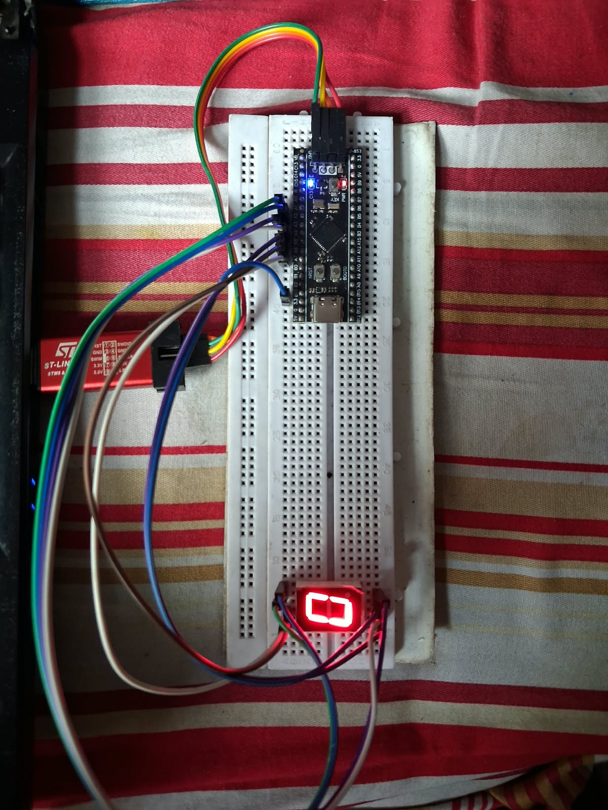
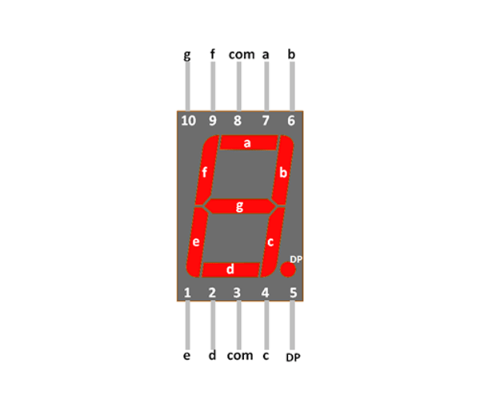
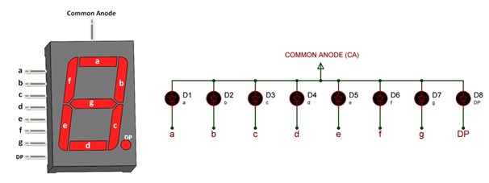
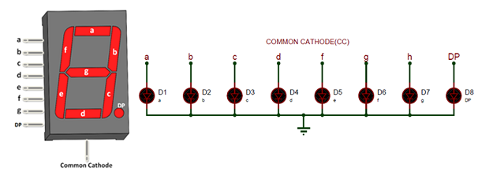

<div align="center">

# Seven Segment Display Driver

**My first STM32 driver: from thinking about the design to lighting a display on a breadboard.**

STM32F411 Black Pill · 5011BS common anode display · C · STM32 HAL


[Design decisions](#how-i-thought-about-the-driver-before-writing-it) · [User guide](#how-to-use-this-driver) · [My prototype](#my-breadboard-prototype) · [Display basics](#what-i-wish-i-had-understood-before-wiring-it) · [Wiring](#wiring) · [Build](#build-and-flash)

</div>

## How I thought about the driver before writing it

We are in an era where AI agents can write code. But I think we still have a huge role to play. Before asking how to write a function, we need to understand what problem it should solve and how someone else will use it. Choosing the interface, understanding the hardware and checking the behavior are still our responsibilities.

This is my first project in this collection. If Allah wills, I will add many more. I want to share what I thought about before designing this driver so someone starting out can follow both the code and the reasoning behind it.

### First, give yourself time to understand C

One of the first things you may struggle with is C itself. My request is to spend some time on pointers, `static`, `const`, `typedef` and structs. These concepts become much easier to understand when you see the job each one does in a small project.

In this driver, a struct keeps a port and pin together. An array holds the wiring for seven segments. A pointer lets the function access that array. A constant table holds the digit patterns. I will walk through each part using my code.

### What if someone connects the display to different pins?

When I started designing the driver, I asked myself how it could be useful to someone else. You might use a different board layout or already have some pins occupied. Your segments might even connect to different GPIO ports.

I did not want your wiring choices to require changes throughout the driver. I wanted you to describe your connections in one place. Each segment needs two pieces of information: its GPIO port and its pin. I packed those into a struct:

```c
typedef struct {
    GPIO_TypeDef *port;
    uint16_t pin;
} seven_seg_pin;
```

`GPIO_TypeDef` is the type provided by the STM32 device headers to describe a GPIO port's registers. The `*` makes `port` a pointer. A value such as `GPIOA` points to port A's register block; we do not copy the whole block into the struct.

`pin` stores the HAL pin mask. For example, `GPIO_PIN_1` identifies pin 1 within the selected port. It is a bit mask, not simply the number you read from a display's package pin.

`typedef` gives this structure the name `seven_seg_pin`. I can now declare an array of these entries without writing the full struct definition again. One entry describes one segment's connection.

### Put the wiring in an array

For my demonstration, I connected segments a through g sequentially to PA1 through PA7 because it was easy to follow on the breadboard. This is the array in my `main.c`:

```c
seven_seg_pin pins[7] = {
    {GPIOA, GPIO_PIN_1},
    {GPIOA, GPIO_PIN_2},
    {GPIOA, GPIO_PIN_3},
    {GPIOA, GPIO_PIN_4},
    {GPIOA, GPIO_PIN_5},
    {GPIOA, GPIO_PIN_6},
    {GPIOA, GPIO_PIN_7}
};
```

The entries follow **a, b, c, d, e, f, g** order. So `pins[0]` describes segment a and `pins[6]` describes segment g. That order connects the wiring array to the digit table.

You do not have to use my sequential connections. If you connect segment a to an available PB0, its first entry becomes `{GPIOB, GPIO_PIN_0}`. Keep it in the first position because it still describes segment a. Check that your chosen pins are available on your board and configure their GPIO clocks and output modes before calling the driver.

### Keep the shape of a digit separate from the wiring

The wiring can change but the segments that form a digit stay the same. I kept those patterns in a separate table:

```c
static const uint8_t display[10][7] =
{
//   a  b  c  d  e  f  g
    {1, 1, 1, 1, 1, 1, 0},  // 0
    {0, 1, 1, 0, 0, 0, 0},  // 1
    {1, 1, 0, 1, 1, 0, 1},  // 2
    {1, 1, 1, 1, 0, 0, 1},  // 3
    {0, 1, 1, 0, 0, 1, 1},  // 4
    {1, 0, 1, 1, 0, 1, 1},  // 5
    {1, 0, 1, 1, 1, 1, 1},  // 6
    {1, 1, 1, 0, 0, 0, 0},  // 7
    {1, 1, 1, 1, 1, 1, 1},  // 8
    {1, 1, 1, 1, 0, 1, 1}   // 9
};
```

There are ten rows for digits 0 through 9. Each row contains seven values for segments a through g. `uint8_t` is an unsigned eight bit integer type, which is enough to hold each 0 or 1.

At file scope, `static` keeps the table's name local to this source file. Other source files use the public function instead of accessing the table directly. `const` says these patterns must not be modified through this declaration. The table is created once and exists for the lifetime of the program.

Look at row zero. Its first six values are 1 and its final value is 0. That means the outside segments light up while the middle segment stays off.

A **1 means the segment should be on**. It does not necessarily mean the GPIO should be HIGH. That depends on the display type.

### Let the user choose the display type

I used a common anode display. You might have a common cathode display. I wanted the same function to support either one, so I made the display type a parameter:

```c
typedef enum {
    COMMON_CATHODE,
    COMMON_ANNODE
} disp_type;
```

The enum gives names to the two choices. `disp_type` is the type used for that parameter. The spelling `COMMON_ANNODE` is the identifier in my current code, so use that exact spelling when calling the function.

For direct GPIO drive, the electrical behavior is:

| Display type | Common connection | Segment on | Segment off |
| --- | --- | --- | --- |
| Common anode | Positive display supply | LOW | HIGH |
| Common cathode | Ground | HIGH | LOW |

This is why I kept the digit table independent of electrical polarity. The pattern says what to illuminate and the function translates it for the selected display.

### One function brings these decisions together

Here is my updated function from [`seven_segment.c`](Core/Src/seven_segment.c), with spacing adjusted for readability:

```c
void seven_segment_set_digit(const seven_seg_pin *pinSetUp,
                             uint8_t digit,
                             disp_type type)
{
    GPIO_PinState trigger_state =
        (type == COMMON_ANNODE ? GPIO_PIN_RESET : GPIO_PIN_SET);

    for (uint8_t i = 0; i < 7; i++)
    {
        if (trigger_state == GPIO_PIN_RESET)
        {
            HAL_GPIO_WritePin(pinSetUp[i].port, pinSetUp[i].pin,
                              display[digit][i] ? GPIO_PIN_RESET : GPIO_PIN_SET);
        }
        else
        {
            HAL_GPIO_WritePin(pinSetUp[i].port, pinSetUp[i].pin,
                              display[digit][i] ? GPIO_PIN_SET : GPIO_PIN_RESET);
        }
    }
}
```

**The parameters.** When you pass `pins`, the array expression converts to a pointer to its first entry. `pinSetUp` receives that pointer, so the function can access your seven entries without copying the array. The `const` means this function cannot modify the entries through that pointer. It does not stop HAL from writing to the GPIO hardware. `digit` selects the table row and `type` selects the output polarity. The function returns `void` because it does not return a result value.

**The polarity selection.** The expression `condition ? first : second` is C's conditional operator. Here it stores `GPIO_PIN_RESET` for common anode or `GPIO_PIN_SET` for common cathode. `trigger_state` is a GPIO state value, not a pointer. It represents the level that turns a segment on.

**The loop.** `i` runs from 0 through 6. On each iteration, `pinSetUp[i].port` supplies the port and `pinSetUp[i].pin` supplies its pin mask. The dot selects a member of that struct entry. `display[digit][i]` reads whether the matching segment belongs to the requested digit.

**The write.** For common anode, a table value of 1 selects RESET and a value of 0 selects SET. For common cathode, those choices are reversed. HAL writes that level to the selected pin. After seven iterations, all seven segment outputs have been updated.

For my call with digit 0 and `COMMON_ANNODE`, iterations 0 through 5 drive segments a through f LOW. Iteration 6 drives segment g HIGH. The display shows 0.

### What belongs to the user and what belongs to the driver?

| Part | Responsibility |
| --- | --- |
| Your application | Choose suitable GPIOs, configure them and supply the pin array |
| Pin array | Describe the connection for each segment in a through g order |
| Digit table | Describe which segments form each digit |
| Display type | Tell the function which electrical polarity to use |
| Driver function | Combine the pattern with your wiring and write the outputs through HAL |

This is the modularity I wanted: you can change your wiring or display type without rewriting the digit patterns. It remains an STM32 HAL driver, so adapting it to another microcontroller platform would also require changing the GPIO interface.

## How to use this driver

### 1. Include the header

Add this in your application, such as the `USER CODE BEGIN Includes` section in CubeIDE's `main.c`:

```c
#include "seven_segment.h"
```

If you are adding the driver to another STM32 project, include both [`seven_segment.h`](Core/Inc/seven_segment.h) and [`seven_segment.c`](Core/Src/seven_segment.c) in that project's build. The header includes `main.h`, which must provide the compatible STM32 HAL types.

### 2. Define your own port and pin array

Declare seven entries in **a, b, c, d, e, f, g** order. Here is my demonstration mapping with the segment names shown:

```c
seven_seg_pin pins[7] = {
    {GPIOA, GPIO_PIN_1},  // a
    {GPIOA, GPIO_PIN_2},  // b
    {GPIOA, GPIO_PIN_3},  // c
    {GPIOA, GPIO_PIN_4},  // d
    {GPIOA, GPIO_PIN_5},  // e
    {GPIOA, GPIO_PIN_6},  // f
    {GPIOA, GPIO_PIN_7}   // g
};
```

Replace the port and pin values to match your wiring. They do not have to be sequential or all on the same port. Keep each segment in its corresponding array position.

### 3. Initialize the GPIOs

In CubeMX or CubeIDE's configuration editor, configure your selected pins as GPIO outputs. My project uses push pull outputs with no pull resistors. Ensure the relevant GPIO clocks are enabled and the initialization code has run before calling the driver. In my example, `HAL_Init()`, `SystemClock_Config()` and `MX_GPIO_Init()` run first.

### 4. Pass the array, digit and display type

For my common anode display, I call:

```c
seven_segment_set_digit(pins, 0, COMMON_ANNODE);
```

If your hardware is common cathode, use:

```c
seven_segment_set_digit(pins, 0, COMMON_CATHODE);
```

The first argument is your wiring array. The second is the digit you want to show. The third is your physical display type. To display 5 on my setup, I change only the second argument to `5`.

Pass a valid array containing seven initialized entries and a digit from **0 through 9**. The function uses these values directly, so validate any external input in your application before passing it in. Each call sets one digit; the application decides when to change it. This driver controls segments a through g of one display.

## My breadboard prototype

<p align="center">
  
  <br>
  <sub>My Black Pill and 5011BS common anode display showing digit 0.</sub>
</p>

I built and tested this prototype on a breadboard. For this demonstration, I used a **5011BS common anode display**, powered it from the Black Pill's **3.3 V** supply and connected the segments sequentially to **PA1 through PA7**. The photo shows digit 0, which is also the digit requested by my current example.

You can use a different suitable pin arrangement and choose the display type that matches your hardware. Define those choices in your pin array and function call.

## What I wish I had understood before wiring it

When I first started this project, I struggled with the documentation. I wanted to get a number on the display but first I needed to understand its pins and internal connections. I am keeping these pictures here so you can connect the code to the hardware more easily.

### Segment letters and physical pins are different

<p align="center">
  
</p>

There are three labels to keep track of: the **segment letter**, the **display's physical pin number** and the **STM32 GPIO name**. In my code, segment a connects to PA1. That does not mean a is physical pin 1 on the display.

The picture labels the top segment a, the middle segment g and the small dot DP. The two `com` labels mark the common connections. Use this picture to understand the naming but check your exact display's datasheet for its physical pin numbers and viewing orientation.

### Common anode is what I used

<p align="center">
  
  <br>
  <sub>This drawing shows common anode despite the downloaded filename.</sub>
</p>

The joined line is the shared positive side of the LEDs. On my common anode setup, pulling a segment's other end LOW allows current to flow and lights that segment. That is why the driver uses RESET for an illuminated segment when I pass `COMMON_ANNODE`.

### You may have a common cathode display

<p align="center">
  
  <br>
  <sub>One schematic label reads h. This driver uses segments a through g with DP separate.</sub>
</p>

Here the shared connection is the negative side. Connect the common cathode to ground and a HIGH output can supply current through a resistor to illuminate a segment. Choose `COMMON_CATHODE` for this arrangement. Both internal circuit drawings omit the external resistors and should not be treated as complete wiring instructions.

**Reference and diagram credit:** [Components101: 7 Segment Display Pinout, Working and Datasheet](https://components101.com/displays/7-segment-display-pinout-working-datasheet). These reference diagrams are separate from my own prototype photo. The guide explains the general idea; your component's manufacturer datasheet provides its exact pinout and electrical ratings.

## Hardware at a glance

| Item | What I used |
| --- | --- |
| Board | Black Pill |
| MCU | STM32F411CEU6 |
| Display | 5011BS, one digit |
| Display type | Common anode |
| Display supply | 3.3 V from the Black Pill |
| Assembly | Breadboard and jumper wires |
| Segment outputs | PA1 through PA7 |
| Debug connection | ST-LINK probe shown in the prototype photo |

My prototype lit up without external resistors. For your build, I recommend a current limiting resistor for each segment. Lighting up does not confirm that the LED or GPIO current stays within its rated limits. Choose the resistor values using your display's forward voltage and the current limits of both the display and MCU.

A single resistor at the common connection limits total display current but the brightness can change with the number of lit segments. Separate segment resistors make brightness more consistent. The 3.3 V supply alone does not provide controlled LED current.

## Wiring

This table shows **my demonstration connections**. I used sequential pins for convenience. You can use other suitable GPIO ports and pins by changing the corresponding entries in your array and initializing those outputs.

| Segment | My GPIO | Array index |
| :---: | :---: | :---: |
| a | PA1 | 0 |
| b | PA2 | 1 |
| c | PA3 | 2 |
| d | PA4 | 3 |
| e | PA5 | 4 |
| f | PA6 | 5 |
| g | PA7 | 6 |

For my common anode display, the common connection goes to 3.3 V. For your common cathode display, the common connection goes to ground. Include suitable current limiting when wiring your segments and disconnect power before changing connections. The decimal point is not used in this project.

## Build and flash

1. Clone the collection:

   ```bash
   git clone https://github.com/mdJesan-08/stm32-driver-development-with-HAL.git
   ```

2. In STM32CubeIDE, select **File → Import → General → Existing Projects into Workspace**. Choose the `seven-segment-display-driver` folder. If the project is already open in your workspace, use that existing project.
3. If your wiring differs from mine, update the pin array and configure the selected GPIOs. Select the correct display type in the function call.
4. Choose **Project → Build Project**. The repository includes HAL/CMSIS sources, startup assembly and linker scripts.
5. Connect a compatible SWD probe and configure it in CubeIDE's debug settings. Launch the debugger to program the board and resume execution. My example repeatedly requests digit 0.

<details>
<summary><strong>Configuration details</strong></summary>

The project's [`seven-segment-display-driver.ioc`](seven-segment-display-driver.ioc) records STM32CubeMX **6.15.0**, STM32CubeF4 firmware package **V1.28.3** and STM32CubeIDE as the target IDE. The MCU target is STM32F411CEUx.

Use the `.ioc` to change peripheral settings through a compatible CubeMX/CubeIDE workflow. Keep application edits inside the generated user code sections and review changes after regeneration. The bundled HAL/CMSIS sources let you import the project without first regenerating those dependencies.

</details>

## Where to find the code

| File or folder | What it contains |
| --- | --- |
| [`Core/Inc/seven_segment.h`](Core/Inc/seven_segment.h) | Pin struct, display enum and public function declaration |
| [`Core/Src/seven_segment.c`](Core/Src/seven_segment.c) | Digit table and output function |
| [`Core/Src/main.c`](Core/Src/main.c) | My pin array, initialization and demonstration call |
| [`Core/Startup/`](Core/Startup/) | MCU startup assembly |
| [`Drivers/`](Drivers/) | ST HAL and CMSIS dependencies |
| [`seven-segment-display-driver.ioc`](seven-segment-display-driver.ioc) | CubeMX configuration |
| `STM32F411CEUX_*.ld` | Linker scripts for the MCU's memory layout |

I hope this helps you build your own display project and understand the design behind it. Start with one segment, understand the connection and then bring the full digit together.

## Author and licensing

Created by **[MD. JESAN](https://github.com/mdJesan-08)** as part of [STM32 Driver Development with HAL](../README.md).

A license has not yet been selected for my original driver code. Bundled dependencies retain their existing notices and licenses: [CMSIS](Drivers/CMSIS/LICENSE.txt), [STM32 device support](Drivers/CMSIS/Device/ST/STM32F4xx/LICENSE.txt) and [STM32F4 HAL](Drivers/STM32F4xx_HAL_Driver/LICENSE.txt).
